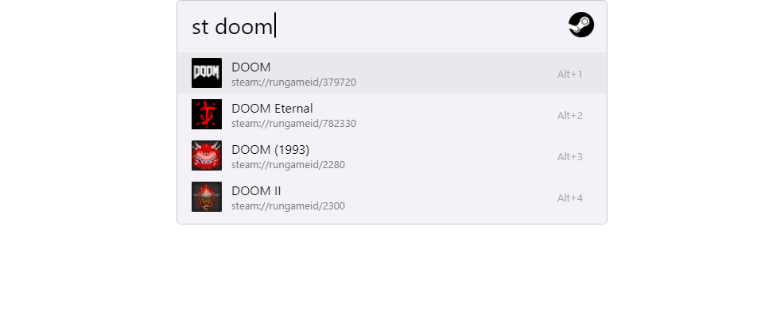
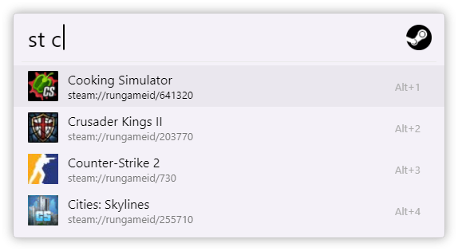
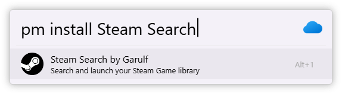

# Steam Search

## Features

* *NEW* Ludacris speeds! Steam-Search is much more efficent! :rocket:
* *NEW* Icons and other game assets work! Icons are fixed and game box art shows in preview pane with `F1`
* Launch games straight from your launcher
* Multiple library support
* Minimal setup and configuration needed (Steam search automatically locates your Steam library!)
* "Non-Steam Game" shortcut support!

## Installation

### Flow Lancher

Simply type `pm install steam search` to have the plugin installed

### Manual Installation

Unzip [Steam-Search.zip](https://github.com/Garulf/Steam-Search/releases/latest) to your launchers plugin directory.

| Launcher      | Plugin Path                      |
|---------------|----------------------------------|
| Flow Launcher | `%appdata%\FlowLauncher\Plugins` |

## Support this project

