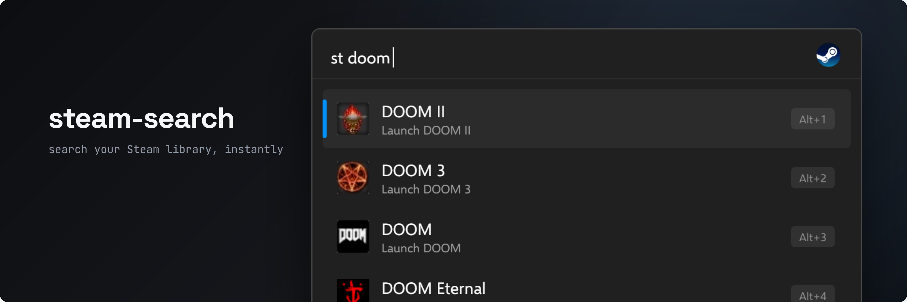
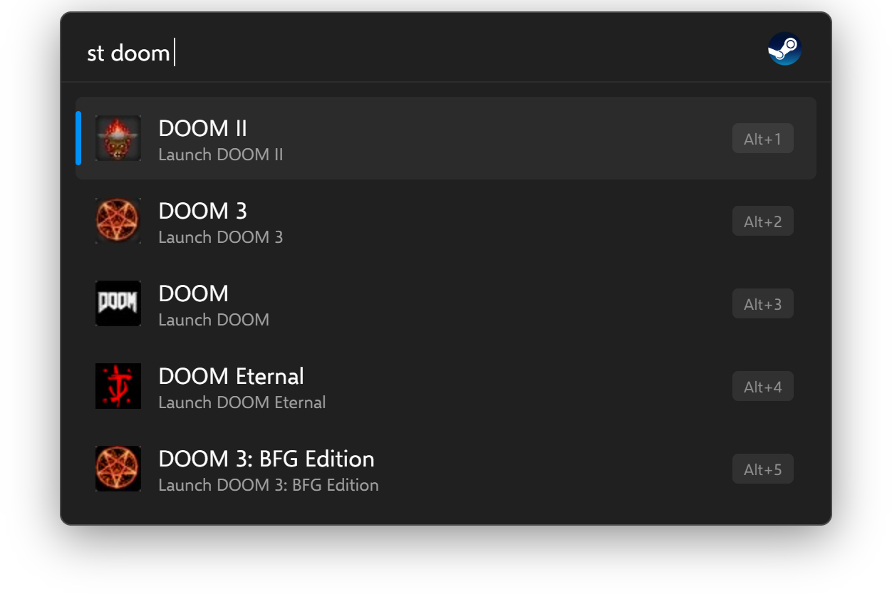
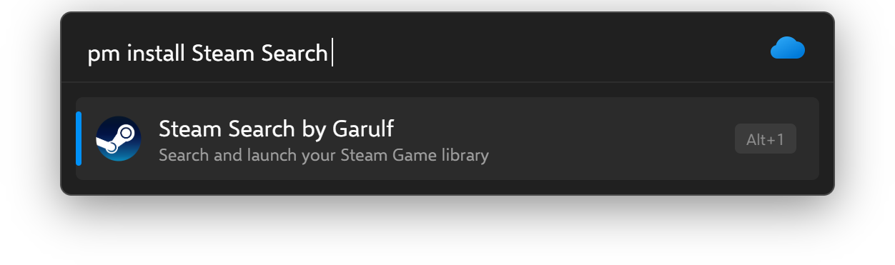

<!-- generated by readwright from docs/README.md.j2; edit the template, not this file -->


# Steam Search

The fastest way to launch your Steam games. Fully local, and instant.

[](https://github.com/Garulf/Steam-Search/actions/workflows/release.yml) [](https://github.com/Garulf/Steam-Search/releases/latest) [](https://github.com/Garulf/Steam-Search/blob/main/LICENSE)

[](https://www.buymeacoffee.com/garulf) [](https://github.com/sponsors/Garulf)

## Features

* **Instant, fully local search.** Your library is read straight from Steam on disk. No web requests, no API keys, no waiting.
* **Search, click, play.** Pick a result and the game launches. No trip through the Steam client first.
* **Fuzzy matching.** Uses Flow Launcher's own matcher, so `st eternal` finds DOOM Eternal and minor typos still hit.
* **Icons and box art.** Results show each game's icon, and `F1` previews its library artwork.
* **Every library folder.** Games installed across multiple drives and library folders all show up.
* **Non-Steam shortcuts too.** Anything you've added to Steam as a shortcut is searchable alongside your Steam games.
* **Zero configuration.** Your Steam install is located automatically; install the plugin and start typing.

## Usage

Type `st` followed by a game name:

```
st doom
```



## Installation

### Flow Launcher

In Flow Launcher, type:

```
pm install steam search
```



### Manual installation

Download `Steam-Search.zip` from the [latest release](https://github.com/Garulf/Steam-Search/releases/latest) and unzip it into
`%appdata%\FlowLauncher\Plugins`, then restart Flow Launcher.

## Changelog

### [12.1.4](https://github.com/Garulf/Steam-Search/releases/tag/v12.1.4) - 2026-08-02

- Update assets by @Garulf in https://github.com/Garulf/Steam-Search/pull/84

### [12.1.3](https://github.com/Garulf/Steam-Search/releases/tag/v12.1.3) - 2026-08-01

- fix: hide Steamworks Common Redistributables from results by @Garulf in https://github.com/Garulf/Steam-Search/pull/83

### [12.1.2](https://github.com/Garulf/Steam-Search/releases/tag/v12.1.2) - 2026-07-31

- bump: steam-client 6.0.2 by @Garulf in https://github.com/Garulf/Steam-Search/pull/82

See [CHANGELOG.md](CHANGELOG.md) for the full history.
