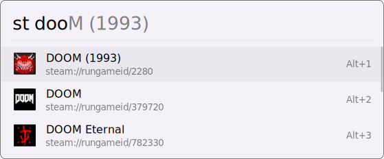

# Steam Search
Search and launch your Steam Game library

Simply type `st` to start searching your steam library

## Features

* Launch games straight from your launcher
* Multiple library support
* Minimal setup and configuration needed (Steam search automatically locates your Steam library!)
* *NEW* with v4.0.x "Non-Steam Game" shortcut support!
* *NEW* v7+ Better search matching/scoring!

# Installation:

### Flow Lancher:

Simply type `pm install steam search` to have the plugin installed

### Manual Installation:

Unzip [Steam-Search.zip](https://github.com/Garulf/Steam-Search/releases/latest) to your launchers plugin directory.

| Launcher      | Plugin Path                      |
|---------------|----------------------------------|
| Wox           | `%appdata%\Wox\Plugins`          |
| Flow Launcher | `%appdata%\FlowLauncher\Plugins` |

##

